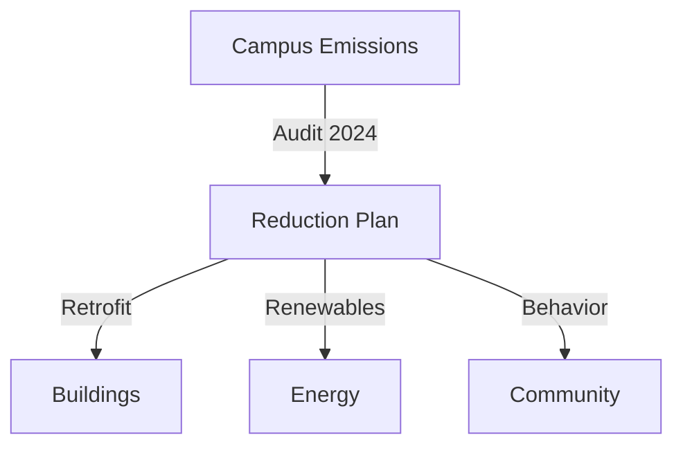

# TH Rosenheim
## Strength in Applied Sciences

Bridging Bavarian tradition with future-ready engineering, design, and business talent.

---
layout: two-cols
transition: fade-out

## Snapshot
- Founded 1971 as a state university of applied sciences
- ~6,500 students, 75+ nations
- Campuses: Rosenheim, Burghausen, Mühldorf am Inn
- Focus areas: Engineering, Design, Business, Health

::right::

## Why it matters
1. Strong industry co-ops drive applied research
2. High employability in southern Germany's Mittelstand
3. Strategic gateway between Munich and Salzburg

---
layout: section
class: text-center

# History & Milestones

---

## Timeline Highlights

| Year | Milestone |
| --- | --- |
| 1971 | State approval & opening as FH Rosenheim |
| 1995 | Launch of wood technology & design cluster |
| 2010 | Expansion to Burghausen campus |
| 2019 | Renamed "TH Rosenheim" signaling tech leadership |
| 2023 | New research center for sustainable building |

> Tradition in timber engineering evolved into cross-disciplinary smart-building expertise.

---
layout: two-cols-header
header: Academic Profile

::left::
### Faculties
- Applied Engineering
- Interior Architecture, Design & Wood Technology
- Business Administration
- Health & Social Sciences

::right::
### Flagship Programs
- Sustainable Building Technology (M.Sc.)
- Computer Science with AI focus (B.Sc.)
- International Wood Technology (B.Eng.)
- Digital Business & Management (B.A.)

---
layout: fact

## Research & Innovation

- 11 dedicated labs from Smart Mobility to Biopolymer Materials
- €18M+ annual third-party funding
- Applied AI Lab partners with Siemens, KUKA, and local SMEs
- Living labs on campus allow rapid prototyping with students in the loop

---
layout: two-cols

## Industry Integration
- Dual study tracks across 200+ corporate partners
- Semester-long capstone projects co-supervised by engineers in the field
- Patent mentoring office guiding startups from idea to IP

::right::

> Placeholder graphic – replace with an ecosystem map or case study image.

---
layout: image-right
image: https://fakeimg.pl/900x600/e0f2fe/0f172a/?text=Campus+Rosenheim

## Campus Vibe
- Alpine backdrop + short train ride to Munich
- MakerSpace with CNC, AR/VR lab, woodshop heritage
- Strong Erasmus community and international buddy system
- Sustainability garden run by student groups

---
layout: quote

> "At TH Rosenheim we combine precision engineering with Bavarian warmth. Students leave fluent in both CAD models and stakeholder conversations."
> 
> — Prof. Katharina Maier, Vice President Academic Affairs

---
layout: two-cols

## Student Experience

### Support
- "Startklar" onboarding week
- German language coaching for internationals
- Career Center with mock interviews + CV labs

### Community
- Rosenheim Rovers Formula Student team
- International Movie Nights in the Glashaus
- Hiking & mountain biking clubs every weekend

::right::

### Data Points
- 93% employment within 6 months of graduation
- 38% female enrollment in STEM cohorts
- 45% of theses written with industry mentors

---
layout: section
class: text-center

# Internationalization

---

## Global Footprint
- 90 partner universities across 40 countries
- English-taught tracks in Engineering, Business, Health Informatics
- DAAD-funded mobility grants for outgoing students
- Virtual exchange studios linking Rosenheim ↔ Bangkok ↔ São Paulo

---
layout: two-cols
transition: slide-up

## Sustainability Commitments
- Climate-neutral campus roadmap 2030
- Timber construction prototypes for low-carbon housing
- Circular labs repurpose industrial offcuts for design projects

::right::

---
layout: statement
class: text-center

## Strategic Priorities 2025+
1. Grow AI + data literacy across all programs
2. Expand health tech research at Mühldorf campus
3. Deepen partnerships with Alpine sustainability clusters

---
layout: end
class: text-center

# Danke schön!
### Let's co-create the next decade of applied innovation at TH Rosenheim.
